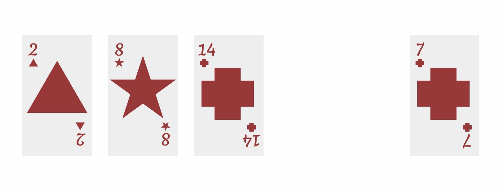

Searching and Sorting are two common CS problems. Several sorting algorithms already exist that solve this problem is some shape or form. Some of the common ones are:

- Selection Sort
- Insertion Sort
- Bubble Sort
- Merge Sort
- Quick Sort
- Heap Sort
- Counting Sort
- Radix Sort

I'll be considering some sorting algorithms and their asymptotic analysis in this piece. Specifically:

- Insertion sort
- Selection sort

### Insertion Sort

The Insertion sort algorithm is one of the easier(to implement) Algorithms. The algorithm builds upon the logic we use to insert an item into an already sorted list
while keeping the list sorted for each insertion. Say for instance you have a hand of cards sorted and you pick a new card from the deck and insert it into the right place keeping the hand sorted.



What you are essentially doing is moving the larger items one place up until you get to an item that is smaller than the item you want to insert, then you insert the item there. In Pseudocode it would look like this:

```Pseudocode
Identify the new item to be inserted
Initialize pointer to the item at the end of the list going from right to left
while the pointer is not at the start of the list? and the item at the pointer is greater than the new item:
    Move the item at the pointer one place up
    move the pointer to the next location
Insert the new item in the "vacant" location
```

Insertion sort builds on the above logic. Essentially we start by considering the first item in the array as already sorted (an array of one item is already), then picking the correct next item from the unsorted part of the array and inserting it into the sorted part. In Pseudocode:

```Pseudocode
- Assume the first item is already sorted
- Go through each item in the unsorted part of the array
- Pick the next smallest item in the unsorted part of the array
- insert the item in correct position in sorted part
```

### Selection Sort

Selection sort works by finding the smallest item in the list and moving it to its proper place, i.e the beginning of the list. Once you have that done, you can move on
to repeating that for the remaining part of the list.

```Pseudocode
For each item in the array:
    the first item is the smallest item seen so far, keep a pointer to it
    For each item to the right of the current smallest item:
        if the item is smaller than the current smallest item:
            update the pointer to point to this new smallest item
    swap the first item with the smallest item
```

## Benchmarking Insertion and Selection Sort Algorithms

For this benchmarking, I compared the performance of the Insertion and Selection sort algorithms against the performance of the [`Arrays.sort()`](https://docs.oracle.com/javase/7/docs/api/java/util/Arrays.html#sort(int[])) method. To achieve a reasonably accurate benchmark, I made sure I applied each algorithm to sorting arrays of exactly the same size and content. Then I timed how long it took to sort using each of the algorithms. I benchmarked using different array lengths using code from the following gist: https://gist.github.com/CEOehis/a5cc4764f9a2bd966d40df9564e7aa61#BenchMarker.java

Benchmarking on arrays with 1, 000 items:

```txt
Creating sample arrays of 1000 items
======================= DONE ===========================
Sorting using selection sort
Selection sort completed in: 3 Milliseconds
======================= DONE ===========================
Sorting using insertion sort
Insertion sort completed in: 2 Milliseconds
======================= DONE ===========================
Sorting using in-built Arrays.sort()
Arrays.sort() sort completed in: 0 Milliseconds
======================= DONE ===========================

Process finished with exit code 0
```

Benchmarking on arrays with 10, 000 items:

```txt
Creating sample arrays of 10000 items
======================= DONE ===========================
Sorting using selection sort
Selection sort completed in: 56 Milliseconds
======================= DONE ===========================
Sorting using insertion sort
Insertion sort completed in: 16 Milliseconds
======================= DONE ===========================
Sorting using in-built Arrays.sort()
Arrays.sort() sort completed in: 2 Milliseconds
======================= DONE ===========================

Process finished with exit code 0
```

Benchmarking on arrays with 100, 000 items:

```txt
Creating sample arrays of 100000 items
======================= DONE ===========================
Sorting using selection sort
Selection sort completed in: 5192 Milliseconds
======================= DONE ===========================
Sorting using insertion sort
Insertion sort completed in: 1141 Milliseconds
======================= DONE ===========================
Sorting using in-built Arrays.sort()
Arrays.sort() sort completed in: 14 Milliseconds
======================= DONE ===========================

Process finished with exit code 0
```

It was exciting to see the performance of the selection or insertion sort algorithms just get worse as the array size increased in multiples of ten, while the inbuilt "Arrays.sort()" method was by far more performant regardless of the size of the array. I tried even up to an array of length 1 million and it was still performant.

One fun thing I tried was to use the selection sort on an array of 1 million items. As expected, it took a very long time. Also, while waiting, I decided to do some maths to calculate how long it is supposed to take. I know that the selection sort has a big O of $O(n^2)$ and on an array of 100,000 items it finished in about 5000 milliseconds. With these bits of information, I was able to deduce how long it should take to sort an array of 1 million items using the following calculations:

$$
execution\ time \approxeq \frac{(1000000^2 \times 5000)}{100000^2}
$$
$$
\approxeq 500000\ ms
$$

It turned out fairly accurate. It completed in 540339 ms.

Benchmarking on arrays with 1, 000, 000 items:

```txt
Creating sample arrays of 1000000 items
======================= DONE ===========================
Sorting using selection sort
Selection sort completed in: 545357 Milliseconds
======================= DONE ===========================
Sorting using insertion sort
Insertion sort completed in: 126578 Milliseconds
======================= DONE ===========================
Sorting using in-built Arrays.sort()
Arrays.sort() sort completed in: 181 Milliseconds
======================= DONE ===========================

Process finished with exit code 0
```

One more thing I've noticed is that insertion sort is faster than selection sort, even though they are both $O(n^2)$ algorithms, in terms of asymptotic analysis.

> The term “asymptotic” here means basically “the tendency in the long run, as the size of the input is increased" (Eck, 2019, p. 418).

I researched more and found that this is because, insertion sort only scans as many items as necessary whereas selection sort must scan the remaining parts of the array. The best case time complexity for insertion sort is $O(n)$ and at the worst case it is $O(n^2)$. While selection sort always runs with a time complexity of $O(n^2)$. Consider the following asymptotic analysis of sorting algorithms from [Big O Cheat Sheet](https://www.bigocheatsheet.com/):


##### Reference

[Eck, D. J. (2019). Introduction to programming using Java, version 8.1. Hobart and William Smith Colleges.](http://math.hws.edu/javanotes)